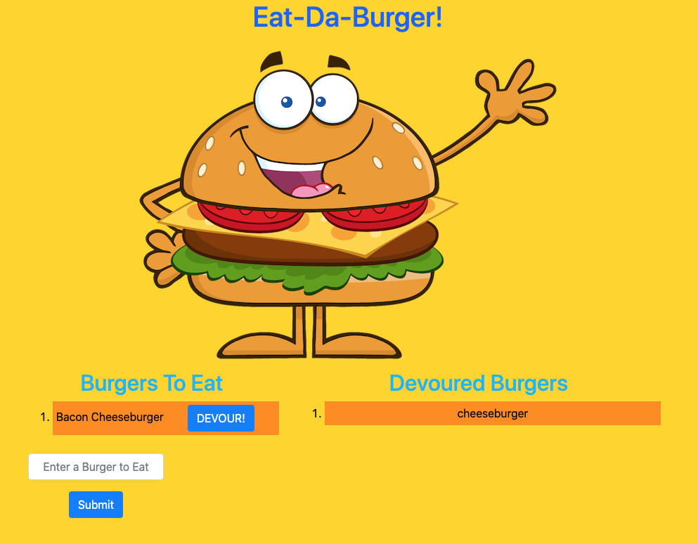

<h1>Burger Logger</h1>
<h2>John Manouse</h2>

I created an application that will allow you to input the type of burger you would like to eat. Once the user submits the burger's name, it will appear in the left hand column "Burgers to Eat" along with a button that will allow the user to "Devour" the burger. Once the button is clicked, it will move the burger to the right hand column, "Devoured Burgers" in a numbered list. The MVC architectural pattern application will use the View, Model, & Controller to generate html using a template engine. Handlebars.js, node modules, Express, API routes, MySQL are used to link the front end to the back end of the application.

 
<h2>Burger Logger Summary</h2>
<ul>
    <li>HTML code</li>
    <li>CSS</li>
    <li>Javascript</li>
    <li>Handlebars.js</li>
    <li>node.js</li>
    <li>Express</li>
    <li>MySQL</li>
</ul>

<h2>Pull Requests welcome for contribution</h2>

John Manouse

Live Link: <a href="https://git.heroku.com/burger411.git"
>Burger-Logger Live Link</a>

Github: <a href="https://github.com/Mirageg4/Burger-Logger">Burger-Logger Repo</a>

              

License: Project is licensed under the MIT License. 
See <a href ="LICENSE.md">LICENSE</a> file for details.